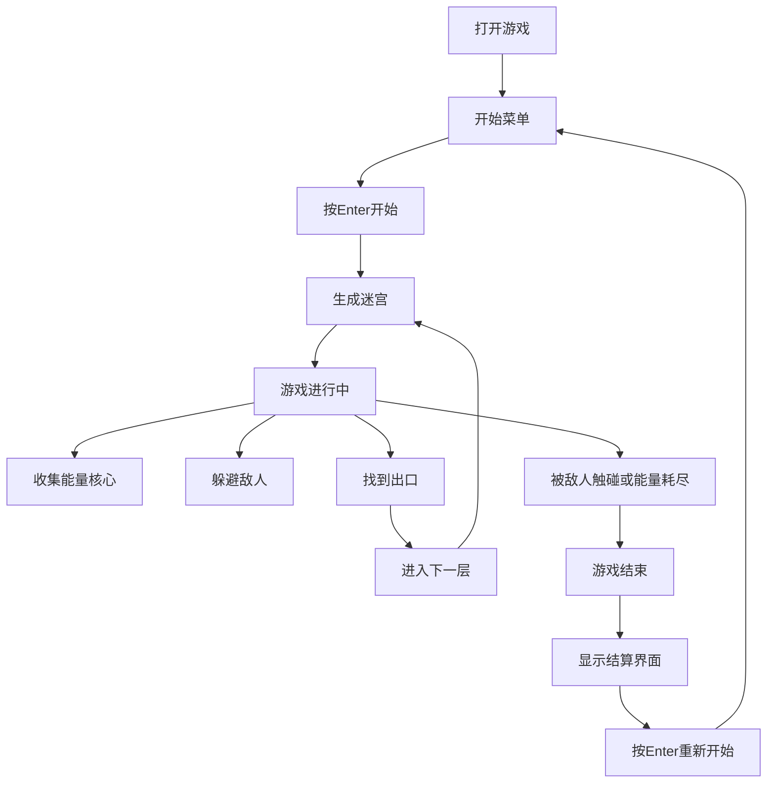

## 1. 产品概述

霓虹迷宫大逃亡是一款基于HTML5 Canvas的PC端单机休闲游戏。玩家控制发光球体在随机生成的霓虹风格迷宫中收集能量核心，躲避追踪敌人，最终找到出口进入下一层。游戏融合了迷宫探索、资源管理和策略躲避等元素，提供无限关卡的挑战体验。

## 2. 核心功能

### 2.1 用户角色

| 角色 | 注册方式 | 核心权限 |
|------|----------|----------|
| 玩家 | 无需注册 | 进行游戏、查看分数记录 |

### 2.2 功能模块

1. **游戏主界面**：开始菜单、游戏画布、HUD信息显示
2. **迷宫系统**：随机迷宫生成、碰撞检测、出口判定
3. **玩家系统**：移动控制、加速技能、能量管理、拖尾特效
4. **敌人系统**：巡逻型敌人、追踪型敌人、瞬移型敌人、AI行为
5. **收集系统**：能量核心生成、收集判定、粒子效果
6. **视觉系统**：霓虹发光效果、屏幕震动、迷雾效果、粒子系统
7. **音效系统**：Web Audio合成音效（移动、收集、受伤、通关）
8. **存档系统**：localStorage存储最高记录

### 2.3 页面详情

| 页面名称 | 模块名称 | 功能描述 |
|----------|----------|----------|
| 开始菜单 | 标题动画 | 游戏名称呼吸动画效果 |
| 开始菜单 | 开始提示 | "按Enter开始"闪烁提示 |
| 开始菜单 | 操作说明 | WASD/方向键移动、空格加速、ESC暂停 |
| 游戏界面 | HUD面板 | 层数、分数、能量条显示 |
| 游戏界面 | 游戏画布 | Canvas渲染迷宫、玩家、敌人、特效 |
| 游戏界面 | 迷雾效果 | 玩家视野外区域变暗 |
| 暂停界面 | 暂停覆盖层 | 半透明覆盖+暂停文字 |
| 结束界面 | 结算面板 | GAME OVER标题、本局数据、最高记录 |

## 3. 核心流程

玩家打开游戏 → 进入开始菜单 → 按Enter开始游戏 → 进入第1层迷宫 → 控制角色移动收集能量核心 → 躲避敌人 → 找到出口进入下一层 → 被敌人触碰或能量耗尽 → 游戏结束 → 显示结算界面 → 按Enter重新开始

## 4. 用户界面设计

### 4.1 设计风格

- **主色调**：深色背景(#0a0a1a) + 荧光色系（玩家青色#00ffff、敌人红色#ff0055、核心黄色#ffff00、墙壁紫色#9933ff）
- **按钮风格**：霓虹发光边框、圆角、悬停时亮度增强
- **字体**：使用等宽像素风格字体(Consolas/Monaco)，营造复古赛博朋克氛围
- **布局风格**：固定逻辑分辨率800x600，响应式缩放保持比例
- **动效风格**：霓虹发光、粒子拖尾、脉冲呼吸、屏幕震动

### 4.2 页面设计概述

| 页面名称 | 模块名称 | UI元素 |
|----------|----------|----------|
| 开始菜单 | 标题 | 大号霓虹文字，青色发光，呼吸动画 |
| 开始菜单 | 开始提示 | 黄色闪烁文字，"按 Enter 开始游戏" |
| 开始菜单 | 操作说明 | 白色小字，列出操作方式 |
| 游戏界面 | HUD | 顶部显示层数(左)、分数(中)、能量条(右) |
| 游戏界面 | 能量条 | 带发光边框的进度条，青色填充 |
| 游戏界面 | 迷宫 | 紫色霓虹墙壁，深色通道 |
| 游戏界面 | 玩家 | 青色发光球体，带拖尾粒子 |
| 游戏界面 | 敌人 | 红色发光体，带警戒范围指示圈 |
| 游戏界面 | 能量核心 | 黄色旋转浮动，脉冲发光 |
| 结束界面 | 标题 | 大号红色"GAME OVER"，抖动效果 |
| 结束界面 | 数据面板 | 本局层数、分数，历史最高记录 |

### 4.3 响应式

- 固定逻辑分辨率800x600，通过Canvas缩放自适应窗口大小
- 保持宽高比，使用letterbox填充多余空间
- 键盘操作，PC端优化

### 4.4 视觉特效

- **霓虹发光**：使用Canvas shadowBlur和shadowColor实现发光效果
- **粒子系统**：对象池管理粒子，用于拖尾、收集、爆炸效果
- **屏幕震动**：通过Canvas translate偏移实现震动
- **迷雾效果**：径向渐变遮罩，玩家周围可见区域清晰
- **脉冲动画**：使用Math.sin(time)实现呼吸发光效果
