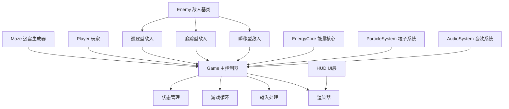

## 1. 架构设计



## 2. 技术描述

- **前端**：原生HTML5 + CSS3 + JavaScript (ES6+)
- **渲染引擎**：HTML5 Canvas 2D API
- **音频引擎**：Web Audio API 合成音效
- **数据存储**：localStorage 本地存储
- **无外部依赖**：单HTML文件内嵌所有代码，无CDN资源

### 技术要点说明

1. **单文件架构**：所有HTML/CSS/JS代码内嵌于单个HTML文件，双击即可运行
2. **固定逻辑分辨率**：800x600逻辑坐标，通过CSS transform缩放适配窗口
3. **固定时间步长**：游戏逻辑使用60fps固定步长更新，渲染与逻辑分离
4. **requestAnimationFrame**：使用标准API实现流畅动画循环
5. **面向对象设计**：使用ES6 Class组织代码，模块化清晰

## 3. 核心类定义

### 3.1 CONFIG 常量配置

| 常量名 | 类型 | 默认值 | 说明 |
|--------|------|--------|------|
| CELL_SIZE | number | 40 | 格子大小(像素) |
| MAZE_WIDTH | number | 15 | 迷宫宽度(格) |
| MAZE_HEIGHT | number | 11 | 迷宫高度(格) |
| PLAYER_SPEED | number | 2.5 | 玩家移动速度 |
| PLAYER_BOOST_SPEED | number | 5 | 加速时速度 |
| ENERGY_DRAIN | number | 0.3 | 加速能量消耗/帧 |
| MAX_ENERGY | number | 100 | 最大能量值 |
| CORE_COUNT_MIN | number | 5 | 最少能量核心数 |
| CORE_COUNT_MAX | number | 8 | 最多能量核心数 |
| ENEMY_COUNT | number | 3 | 基础敌人数 |
| FOG_RADIUS | number | 120 | 迷雾可见半径 |

### 3.2 类结构

```javascript
// 游戏状态枚举
const GameState = { MENU: 0, PLAYING: 1, PAUSED: 2, GAMEOVER: 3 }

// 迷宫单元格
class Cell {
    constructor(x, y)
    walls: { top, right, bottom, left }
    visited: boolean
}

// 迷宫生成器 - 递归回溯算法
class Maze {
    constructor(width, height)
    generate()
    getCell(x, y)
    canMove(x, y, direction)
    getPathCells() // 获取主路径和分支
}

// 玩家类
class Player {
    constructor(x, y)
    update(keys, maze, deltaTime)
    boost() // 加速
    takeDamage() // 受伤
    addEnergy(amount)
}

// 敌人基类
class Enemy {
    constructor(x, y, type)
    update(player, maze, deltaTime)
    checkCollision(player)
}

// 巡逻型敌人
class PatrolEnemy extends Enemy {
    // 沿固定路径移动，视野3格，发现玩家追击
}

// 追踪型敌人
class ChaseEnemy extends Enemy {
    // 始终向玩家方向移动，速度略慢
}

// 瞬移型敌人
class TeleportEnemy extends Enemy {
    // 定期瞬移到玩家附近
}

// 能量核心
class EnergyCore {
    constructor(x, y)
    update(deltaTime) // 旋转浮动动画
}

// 粒子系统
class ParticleSystem {
    emit(x, y, color, count, speed)
    update(deltaTime)
    render(ctx)
}

// 音效系统 - Web Audio合成
class AudioSystem {
    constructor()
    playMove()
    playCollect()
    playHurt()
    playLevelUp()
    playGameOver()
}

// 游戏主控制器
class Game {
    constructor(canvas)
    init()
    start()
    nextLevel()
    gameOver()
    update(deltaTime)
    render()
}
```

## 4. 关键算法

### 4.1 迷宫生成算法（递归回溯）

```
算法思路：
1. 创建一个所有单元格都有四面墙的网格
2. 选择起点单元格，标记为已访问，加入栈
3. 当栈不为空时：
   a. 弹出当前单元格
   b. 检查当前单元格是否有未访问的相邻单元格
   c. 如果有：
      - 随机选择一个未访问的相邻单元格
      - 移除两单元格之间的墙
      - 标记相邻单元格为已访问
      - 将当前单元格和相邻单元格都压入栈
   d. 如果没有，回溯（继续弹出）
4. 主路径生成完成后，随机打通2-3处墙壁形成死胡同分支
```

### 4.2 敌人寻路算法

```
巡逻型 (PatrolEnemy)：
1. 预先生成巡逻路径点
2. 在路径点之间来回移动
3. 每帧检测视野范围内（曼哈顿距离<=3）是否有玩家
4. 发现玩家后切换为追击模式，使用BFS寻路

追踪型 (ChaseEnemy)：
1. 每帧计算玩家所在方向
2. 使用贪心算法向玩家方向移动
3. 遇到墙壁时尝试次优方向

瞬移型 (TeleportEnemy)：
1. 每隔N秒触发一次瞬移
2. 在玩家周围3-5格范围内随机选择可站立位置
3. 瞬移前有警告动画
```

### 4.3 碰撞检测

```
玩家与墙壁：
使用AABB碰撞检测，分别检测X轴和Y轴方向的碰撞，
允许贴墙滑行（分离轴定理简化版）

玩家与敌人：
圆形碰撞检测，计算两圆心距离是否小于半径之和

玩家与能量核心：
距离检测，小于收集阈值即触发收集
```

## 5. 性能优化

1. **对象池模式**：粒子系统使用对象池复用粒子对象，避免频繁GC
2. **离屏渲染**：迷宫墙壁预渲染到离屏Canvas，每帧只需绘制一次
3. **空间分区**：使用网格分区优化碰撞检测，减少检测次数
4. **状态缓存**：游戏状态变更时才重计算，避免每帧重复计算
5. **节流控制**：音效播放节流，避免同一时间播放过多音效
